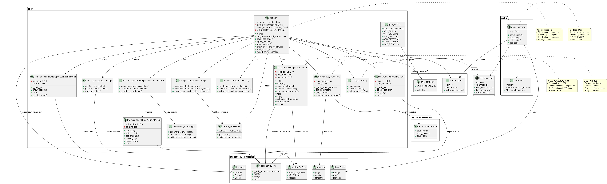
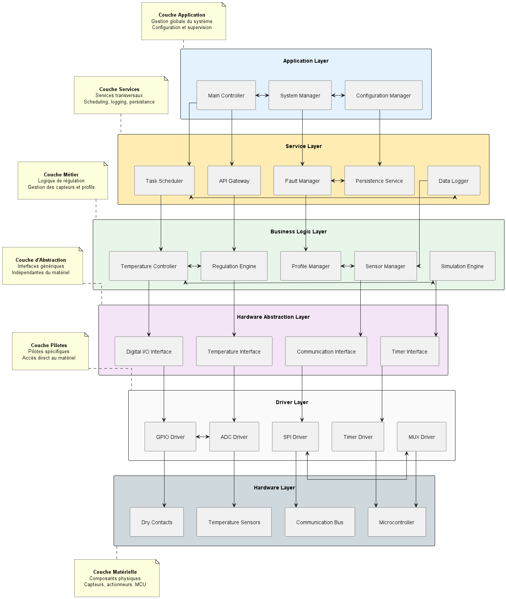
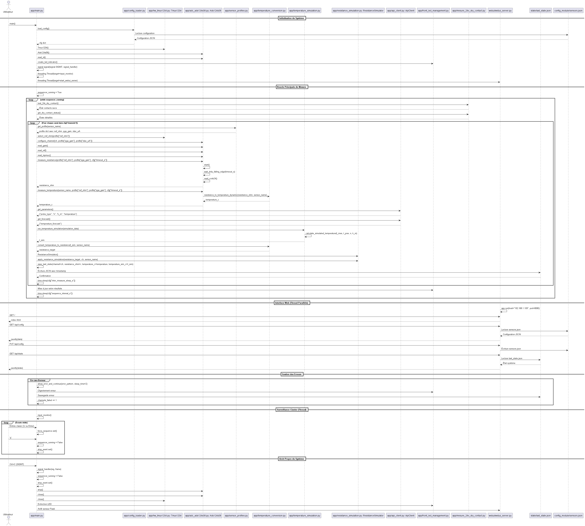
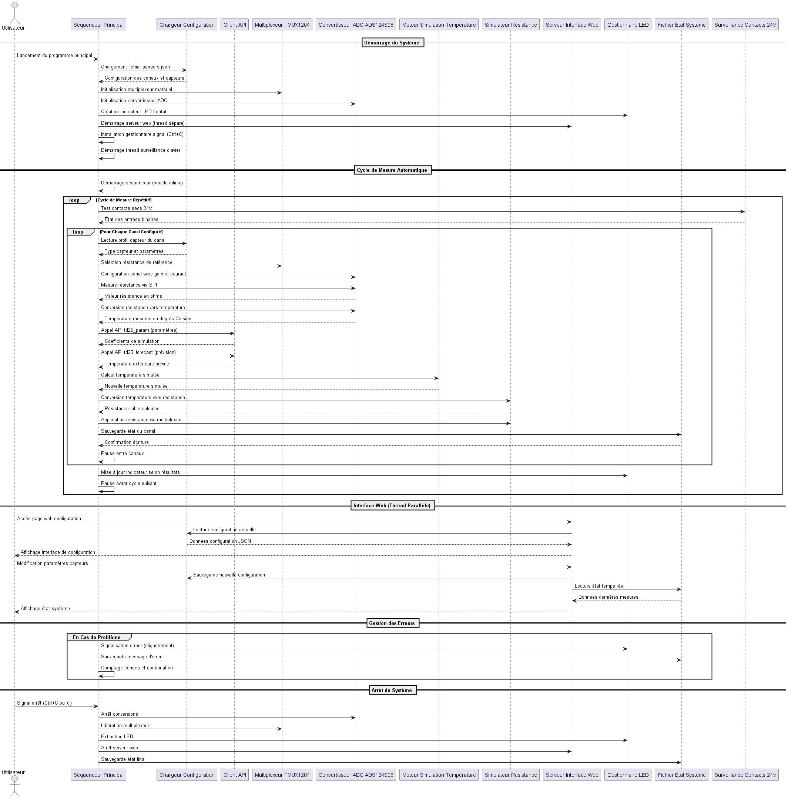

# 2510_RegulationChauffage

## Description
Solution matérielle et logicielle basée sur Raspberry Pi Compute Module 5 pour remplacer un automate de chaudière.  
Le système lit des sondes réelles, calcule une température « simulée » à partir des prévisions météo, et applique une résistance équivalente à la chaudière via un réseau de résistances commandé. Connexion à l'API Oblo en HTTP (GET/POST) et publication des **mesures** & de l'**état** vers un Cloud, conformément au CdC.

**Documentation complète disponible sur : [leomendesesetml.github.io/2510_RegulationChauffage.github.io](https://leomendesesetml.github.io/2510_RegulationChauffage.github.io/index.html)**

## Diagrammes (UML / Architecture / Flux)
| Architecture réelle | Architecture générique |
|---|---|
|  |  |

| Flux d’événements détaillé | Flux d’événements générique |
|---|---|
|  |  |


## Fonctionnalités (réf. CdC v02)
- Récupération des paramètres et prévisions via **API HTTP** (Oblo, GET/POST).
- Lecture d'une sonde de température extérieure (capteur **résistif**), conversion en **°C**.
- Génération d'une **sonde simulée** via réseau de résistances (pilotage **ADG731**).
- **Publication** des mesures et de l'état de l'appareil vers le **Cloud**.
- Cadence périodique **5 minutes**, journalisation en **JSON lines**.
- Gestion de **1 à 4** canaux actifs, contact sec prioritaire, relais bypass et LED d'état.

## Architecture système

### Matériel principal
- **Compute Module 5 (CM5)** - Processeur principal
- **ADS124S08** - ADC delta-sigma, communication **SPI1**, signaux DRDY/START en GPIO
- **TMUX1204** - Multiplexeur sélection **Rref** (A0/A1)
- **ADG731** - Multiplexeur **SPI0** vers réseau de **résistances simulées**
- **Entrée contact sec**, **relais bypass**, **LED** frontale

### Logiciel principal
- **Python 3.11+** avec architecture modulaire
- **spidev**, **periphery** (SPI/GPIO), **requests** (HTTP), **flask** (WebUI)
- Interface web intégrée pour configuration et monitoring
- Service **systemd** et logs JSON rotatifs
- Simulation et validation complète des mesures

## Commandes principales

### Lancement manuel
```bash
# Mode automatique avec cycles 5 minutes
python3 /home/oblo/proj/2510_RegulationChauffage_soft/soft/src/app/main.py

# Mode manuel avec interface web
python3 /home/oblo/proj/2510_RegulationChauffage_soft/soft/src/app/main.py --webui

# Mode manuel sans cycles automatiques
python3 /home/oblo/proj/2510_RegulationChauffage_soft/soft/src/app/main.py --manual

# Exécution unique (test)
python3 /home/oblo/proj/2510_RegulationChauffage_soft/soft/src/app/main.py --once
```

### Service systemd (production)
```bash
# Créer le service avec interface web
sudo tee /etc/systemd/system/2510-regulation.service > /dev/null << 'EOF'
[Unit]
Description=2510 Regulation Chauffage Service with WebUI
After=network.target
Wants=network.target

[Service]
Type=simple
User=oblo
Group=oblo
WorkingDirectory=/home/oblo/proj/2510_RegulationChauffage_soft/soft/src
ExecStart=/usr/bin/python3 /home/oblo/proj/2510_RegulationChauffage_soft/soft/src/app/main.py --webui
Restart=always
RestartSec=10
StandardOutput=journal
StandardError=journal
Environment=PYTHONPATH=/home/oblo/proj/2510_RegulationChauffage_soft/soft/src
Environment=HOME=/home/oblo

[Install]
WantedBy=multi-user.target
EOF

# Activer et démarrer le service
sudo systemctl daemon-reload
sudo systemctl enable 2510-regulation
sudo systemctl start 2510-regulation
```

### Contrôle du service
```bash
# Vérifier le statut du service
sudo systemctl status 2510-regulation

# Vérifier si le service est actif
sudo systemctl is-active 2510-regulation

# Arrêter le service
sudo systemctl stop 2510-regulation

# Redémarrer le service
sudo systemctl restart 2510-regulation

# Voir les logs en temps réel
sudo journalctl -u 2510-regulation -f

# Voir les derniers logs
sudo journalctl -u 2510-regulation -n 50
```

### Monitoring et diagnostic
```bash
# Vérifier le processus Python
ps aux | grep main.py

# Vérifier l'interface web (port 8080)
curl -s http://localhost:8080 > /dev/null && echo "Interface web active" || echo "Interface web inaccessible"

# Vérifier les ports d'écoute
sudo ss -tlnp | grep 8080

# Status complet en une commande
echo "Service:" && sudo systemctl is-active 2510-regulation && echo "Process:" && ps aux | grep -v grep | grep main.py && echo "Port 8080:" && sudo ss -tlnp | grep 8080
```

## Installation et déploiement

### Installation système
```bash
# Dépendances système
sudo apt update
sudo apt install python3-pip python3-venv

# Dépendances Python
pip3 install spidev periphery requests flask

# Configuration SPI
sudo raspi-config  # Activer SPI0 et SPI1
```

### Accès interface web
- **URL locale** : `http://192.168.1.109:8080`
- **Configuration** : Types capteurs, timeouts, intervalles
- **Monitoring** : Données temps réel, historique des mesures
- **API REST** : `/api/config`, `/api/state`

## Flux opératoire (cycle 5 min)

### Séquence de mesure
1. **Contacts secs** - Lecture état prioritaire via mesure_24v_dry_contact.py
2. **Pour chaque canal actif (1-4)** :
   - Sélection **Rref** via TMUX1204
   - Configuration **ADC** via ADS124S08
   - **Mesure single-shot** → code 24 bits → **Tmes**
   - Conversion résistance/température

### Simulation et application
3. **API Oblo** - Récupération paramètres (**N, kM, Tprevu**)
4. **Calcul Tsim** - Formule prédictive temperature_simulation.py
5. **Application MUX** - Résistance simulée via ADG731
6. **Sauvegarde** - État système dans last_state.json

### Gestion d'erreurs
- **LED frontale** - Patterns d'erreur (1Hz normal, 2Hz faute)
- **Relais bypass** - Sécurité en cas de défaut
- **Logs JSON** - Traçabilité complète des événements

## Types de capteurs supportés
- **De Dietrich AF60**, **Siemens QAC32**
- **PT1000**, **Ni1000 TK5000/TK6180**
- **NTC 1k/2k/2.2k/10k** (diverses courbes)
- **KTY81-210**

## API et connectivité

### API oblosolutions.ch
- **Endpoint paramètres** : `GET /td25_param?mac_address=XXX`
- **Endpoint prévisions** : `GET /td25_forecast?mac_address=XXX`
- **Envoi mesures** : `POST /td25_param` avec données température

### Données JSON échangées
```json
{
  "probe_type": "Ni1000 TK5000",
  "n": 0.8,
  "k_m": -0.1,
  "temperature": 18.5,
  "forecast_temperature": 15.2,
  "timestamp": "2025-09-18T14:30:00Z"
}
```

### Configuration réseau
- **Interface** : eth0 (192.168.1.109)
- **Port web** : 8080
- **Timeout API** : 10 secondes
- **Retry** : 3 tentatives

## Mappage matériel CM5

### Configuration SPI
- **SPI0** → **ADG731** (réseau résistif) : SCLK, MOSI, CS[0..3]
- **SPI1** → **ADS124S08** (métrologie) : SCLK, MOSI, MISO, CS

### Table GPIO principale
| Signal               | GPIO | Fonction                    | Description               |
|----------------------|:----:|-----------------------------|---------------------------|
| **MUX CS 1-4**       | 2,3,7,8 | Sélection carte ADG731   | Adressage résistances     |
| **MUX MOSI/SCLK**    | 10,11 | Communication SPI0         | Commande multiplexeur     |
| **CM 24V OUT/SENSE** | 12-15 | Contacts secs              | Entrées prioritaires      |
| **ADC SPI1**         | 17-20 | Communication ADC          | Mesures température       |
| **ADC DRDY/START**   | 21,22 | Signaux contrôle ADC       | Synchronisation mesures   |
| **ADC A0/A1**        | 23,24 | Sélection canal/Rref       | Multiplexage entrées      |
| **FRONT LED**        | 26    | Indicateur état            | Status visuel système     |
| **CMD RELAY**        | 16    | Relais bypass              | Sécurité défaillance      |

## Fichiers de configuration et état

### Fichiers système
```bash
# Configuration capteurs
/home/oblo/proj/2510_RegulationChauffage_soft/soft/src/config_module/sensors.json

# État système (dernières mesures)
/home/oblo/proj/2510_RegulationChauffage_soft/soft/src/state/last_state.json

# Logs système
sudo journalctl -u 2510-regulation

# Configuration service
/etc/systemd/system/2510-regulation.service
```

### Monitoring système
#### Patterns d'erreur : X clignotements sur 10 secondes puis répétition
- 1 clignotement = Pas de connexion Internet
- 2 clignotements = Erreur API (connexion ou réponse)
- 3 clignotements = Erreur de mesure ADC/résistance
- 4 clignotements = Erreur critique système
- 5 clignotements = Erreur de configuration
#### Interface web :
- Dashboard temps réel à `http://192.168.1.109:8080`

## Validation et diagnostics

### Tests système
```bash
# Test communication ADC
python3 -c "from app.adc_ads124s08 import *; print('ADC Test')"

# Test interface web
curl http://localhost:8080/api/state

# Test API oblosolutions (si connecté)
curl "http://api.oblosolutions.ch/td25_param?mac_address=YOUR_MAC"
```

### Troubleshooting
```bash
# Vérifier SPI activé
ls /dev/spi*

# Vérifier permissions GPIO
groups oblo

# Redémarrer service en cas de problème
sudo systemctl restart 2510-regulation

# Logs détaillés
sudo journalctl -u 2510-regulation --since "1 hour ago"
```

---

## Références et documentation

- **Documentation technique complète** : [leomendesesetml.github.io/2510_RegulationChauffage.github.io](https://leomendesesetml.github.io/2510_RegulationChauffage.github.io/index.html)
- **Cahier des charges** : Exigences fonctionnelles et techniques
- **Schémas électroniques** : Plans de câblage et BOM
- **API Documentation** : Spécifications oblosolutions.ch
- **Code source** : Modules Python avec documentation inline

## Informations projet

**Auteur** : Léo Mendes - ETML ES  
**Projet** : 2510_RegulationsChauffage  
**Mandant** : Oblo Solutions  
**Version** : 1.0.0  
**Chemin système** : `/home/oblo/proj/2510_RegulationChauffage_soft/soft/src/`  
**Copyright** : 2025
